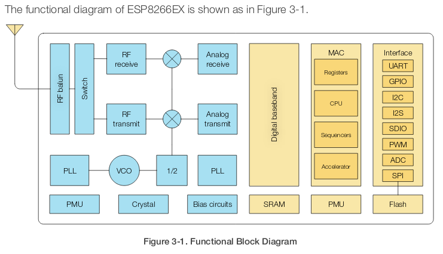

# µPython <!-- .element: style="margin-top:3em" -->
<!-- .slide: data-background="https://upload.wikimedia.org/wikipedia/commons/thumb/4/4e/Micropython-logo.svg/2000px-Micropython-logo.svg.png" data-background-size="30%" data-background-position="top" -->


## ¿Qué es?
Una implementación de Python3 para microcontroladores <!-- .element: class="fragment" data-fragment-index="1" -->

### ¿Qué es un microcontrolador? <!-- .element: class="fragment" data-fragment-index="2" -->
 <!-- .element: class="fragment" data-fragment-index="3" height="40%" width="40%" -->
 <!-- .element: class="fragment" data-fragment-index="4" height="40%" width="40%" -->
[Datasheet ESP8266](https://www.espressif.com/sites/default/files/documentation/0a-esp8266ex_datasheet_en.pdf)
<!-- .element: class="fragment" data-fragment-index="4" -->


## ¿Por qué µPython?
 * Interpretado. Menos velocidad pero portable. 
 * Interactivo. ¡¡Tenemos consola!! 
 * Tenemos muchos [módulos](https://docs.micropython.org/en/latest/library/index.html#python-standard-libraries-and-micro-libraries) a nuestra disposición. 
 * Extensible. Podemos crear los módulos que necesitemos. CPython. 
### Más alto nivel. <!-- .element: class="fragment" data-fragment-index="5" -->


## Cambios de firmware al instante


## Empecemos...


### ¿Qué necesitamos?
 1. µcontrolador compatible: Pyboard, WiPy, ESP8266, ESP32...
 2. Ordenador con python (solo al principio)
 3. Firmware (intérprete de µPython)
 4. 5 minutos


### Descargar intérprete de la web [http://micropython.org/](http://micropython.org/)
<!-- .slide: data-background="img/download_micropython.png" data-background-position="top" data-background-opacity="0.4" -->


### Instalar esptool
<!-- .slide: data-background="img/installing_esptool.png" data-background-position="top" data-background-opacity="0.1" -->
`pip3 install esptool`


### Flashear el µcontrolador
<!-- .slide: data-background="img/flashing_esp8266.png" data-background-position="top" data-background-opacity="0.1" -->
`esptool.py --port /dev/ttyUSB0 erase_flash`

`esptool.py --port /dev/ttyUSB0 --baud 460800 write_flash --flash_size=detect 0 esp8266-20170108-v1.8.7.bin`

[Docu](http://docs.micropython.org/en/latest/esp8266/tutorial/intro.html#deploying-the-firmware)


## Algo nuevo se huele en el ambiente
<!-- .slide: data-background="img/new_wifi.jpg" data-background-position="top" data-background-opacity="0.2" -->
### ¡¡Y listo para su uso y disfrute!!


## ¿Nos conectamos al aparato?
 * Conexión serie (115200 br):
    * screen, picocom...
    * PuTTY...
 * WiFi: WebREPL (Read Evaluate Print Loop)


## Hacer pruebas con un µcontrolador por WiFi...
# mola <!-- .element: class="fragment" data-fragment-index="1" -->


## Vamos a configurarlo
<!-- .slide: data-background="img/configure_webrepl.png" data-background-position="top left" data-background-opacity="0.2" -->
`import webrepl_setup`

boot.py
```python
import webrepl
webrepl.start()
```

Y lo subimos al µcontrolador:

`pip3 install adafruit-ampy`

`ampy -p /dev/ttyUSB0 put boot.py`


### Incluso lo podemos reiniciar con AMPY
`ampy -p /dev/ttyUSB0 reset`


## WebREPL
<!-- .slide: data-background="img/webrepl.png" data-background-position="top left" data-background-opacity="0.3" -->
[Repo](https://github.com/micropython/webrepl)


## ¿Encendemos un LED?
<!-- .slide: data-background="img/led_builtin.jpg" data-background-position="bottom right" data-background-opacity="0.3" -->
```python
import machine
led = machine.Pin(2, machine.Pin.OUT)
led.value()
led.off() # led.value(0)
led.on()  # led.value(1)
```


# ¿Dudas hasta ahora?
<!-- .slide: data-background="img/questions.jpg" data-background-opacity="0.5" -->


## ¿Y ese `boot.py`?
µPython es más que un intérprete.

### Tiene un sistema de archivos interno. <!-- .element: class="fragment" data-fragment-index="1" -->
Tipo EEPROM (Arduino) pero mejor. <!-- .element: class="fragment" data-fragment-index="2" -->


## Dos archivos especiales
 * `boot.py`: se ejecuta primero, si existe.
 * `main.py`: se ejecuta.

En boot.py se suele configurar el µcontrolador: WiFi, pines... <!-- .element: class="fragment" data-fragment-index="1" -->

En main.py irá la programación del µ. <!-- .element: class="fragment" data-fragment-index="2" -->

### ¡Ojo con el while True! <!-- .element: class="fragment" data-fragment-index="3" -->


## Jugando con el sistema de archivos
```python
f = open('archivo.txt', 'w')
f.write("hola!! estoy en un archivo") # Devuelve la longitud
f.close()
```

```python
f = open('archivo.txt')
f.read()
f.close()
``` 
<!-- .element: class="fragment" data-fragment-index="1" -->


# ¡Eso se puede hacer con EEPROM!
## No es nuevo


## ¿Listar archivos?
```python
import os
os.listdir()
```


## ¿Crear carpetas en un µcontrolador?
```python
import os
os.mkdir('carpeta')
```
### Y eliminarlas <!-- .element: class="fragment" data-fragment-index="1" -->
```python
import os
os.rmdir('carpeta')
```
<!-- .element: class="fragment" data-fragment-index="1" -->


## ¿Eliminar archivos?
```python
import os
os.remove('archivo.txt')
```


# Pequeño ""OS""
```python
import os
os.uname()
```
<!-- .element: class="fragment" data-fragment-index="1" -->
¿µPython os ha sorprendido? <!-- .element: class="fragment" data-fragment-index="2" -->